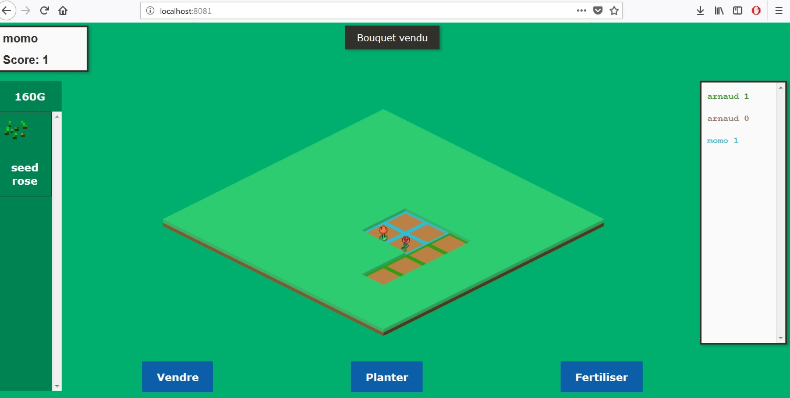

# PlantTycoonSimulator
Un super jeu de navigateur qui supplantera (PLANTE LOL) bientot Ogame FarmVille et autre Clash of Clans

## Développement

Il y a même un Trello : https://trello.com/b/VOPO9G3D/Planttycoonsimulator

## Dev Get started

Prérequis : avoir node/npm

 - cloner le dépot
 - npm install 
 - npm start

 Le serveur tourne sur le port 8081.
 Le client est alors disponible à cette adresse: http://localhost:8081

## Principe

Il s'agit de créer un jeu multijoueur de stratégie par navigateur type Ogmae/Farmville.

## But

Une partie dure un temps déterminé (possiblement 1 jour)
Le but est d'engranger un maximum de points en réalisant des bouquets de fleurs.
Chaque bouquet de fleurs est constitué de fleurs aléatoires.
Pour faire pousser des fleurs, le joueur dispose de parcelles de terrains sur lesquelles il peut faire pousser des fleurs. Chaque fleur grandit avec le temps.
Mais attention, il y a un nombre limité de places sur le terrain.
Faites du commerce avec vos adversaires, rachetez les graines à bas prix, obtenez le monopole de la tulipe, utilisez les pesticides pour accélérer la croissance de vos plantes. Mais attention aux effets aléatoires, vous pourriez bien subir une vague de sauterelles ou un ouragan.

## Stratégie

Le joueur peut décider de :

 - planter une graine
 - récolter une graine
 - fertiliser une parcelle
 - Acheter une parcelle
 - vendre une ou plusieurs fleurs de son inventaire
 - planter une ou plusieurs graines de son inventaire
